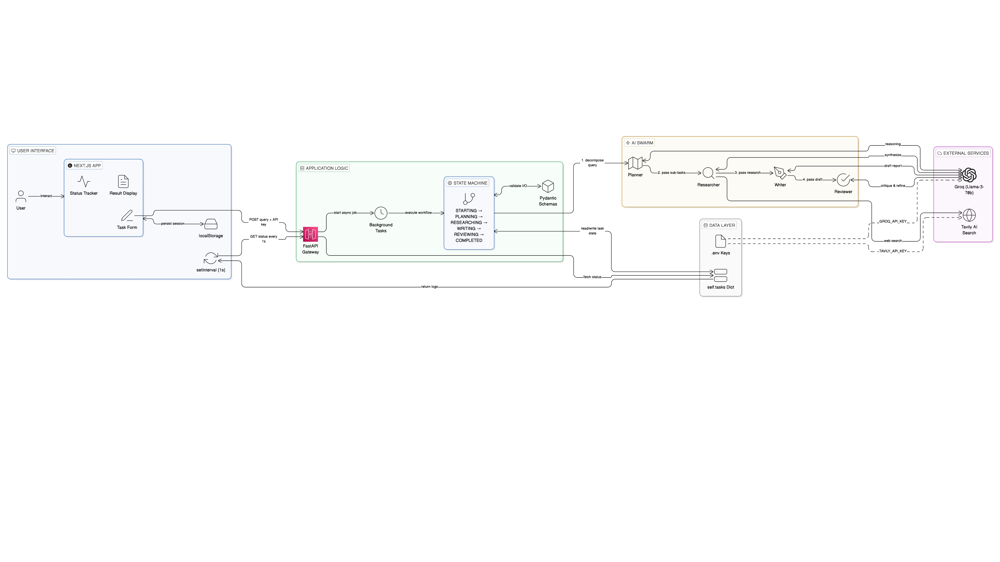

# Multi-Agent Orchestrator (The "Paramount" Assignment)

> **🚀 Live Deployment Links (For Reviewers)**
> *   **Frontend (App):** [https://multi-agent-orchestrator-paramount.vercel.app/](https://multi-agent-orchestrator-paramount-8njk2ys2v.vercel.app?_vercel_share=8ECMnotwLXWAkTK0SYuKKwO7d4oP6eeZ)
> *   **Backend (API):** [https://multi-agent-orchestrator-paramount.onrender.com/docs](https://multi-agent-orchestrator-paramount.onrender.com/docs)
> *   **Video Walkthrough:** [Insert Google Drive/Loom Link Here]

---

## This Isn't Just a Chatbot.
This is a state-aware orchestration engine. I built this to solve a specific problem: **LLMs are great at thinking, but bad at following a multi-step process without getting distracted.**

This system forces the AI to stay on track. It breaks a vague request into a plan, executes real searches (no hallucinations allowed), drafts a report, and then polishes it. It’s the difference between a "chat" and a "workflow."

## What's Under the Hood?
*   **The Brain:** Python 3.10 + FastAPI. It manages the state machine. It doesn't just "fire and forget"; it tracks every step.
*   **The Face:** Next.js + React. I used **CSS Grid** for the UI because flexbox alignment on status trackers is usually sloppy. This one is pixel-perfect.
*   **The Intelligence:** Groq (Llama-3) for speed + Tavily for real-time truth.

## How It Works (Architecture)


## How to Run It (Locally)


### 1. The Backend (The Engine)
You need to feed it API keys. I put a `.env.example` file in there, but you'll need your own `GROQ_API_KEY` and `TAVILY_API_KEY`.

```bash
cd backend
# I use Conda because it's cleaner than venv
conda create -n multi_agent_orchestrator python=3.10 -y
conda activate multi_agent_orchestrator
pip install -r requirements.txt

# Create your .env file here!
# TAVILY_API_KEY=tvly-xxx
# GROQ_API_KEY=gsk-xxx

uvicorn app.main:app --reload --port 8000
```

### 2. The Frontend (The Dashboard)
Open a new terminal. Don't close the backend one.

```bash
cd frontend
npm install
npm run dev
```
Go to `http://localhost:3000`.

## Features I'm Proud Of
1.  **Real Persistence:** Refresh the page. Go ahead. Your research task is still there. I used `localStorage` because losing data is the worst UX.
2.  **No "Fake News":** If the Researcher can't find a source via Tavily, it admits it. It doesn't make up URLs.
3.  **The "Nuclear" CSS Fix:** You might notice the icons are perfectly centered. That took a custom Grid implementation. Details matter.

## Project Structure
*   `backend/app/agents/`: Where the prompt engineering lives.
*   `backend/app/orchestrator.py`: The actual state machine logic.
*   `frontend/src/components/`: The React logic.

---
**Author:** Pathange Omkareshwara Rao
**Education:** Final Year B.Tech CSE-AI, Amrita Vishwa Vidyapeetham, Coimbatore
